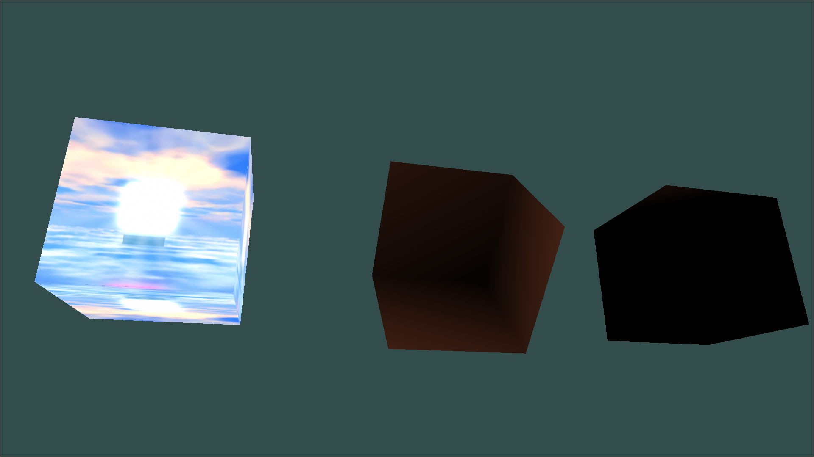

# Zephyros 12/15/2025 1

A general-purpose log

## Comments from a peer

When i showed a peer, who i will refer to as "Z", and showed him diene's profile, he responded with "Ima styrenide yo ahh", a mispronounce of "styrenediene". 

Stay young and beautiful and unique queen

He then made a jerking off motion towards another one of my peers, i believe he is gay but only 10% of the time (as he stated earlier)

## Textures

I refactored the client/main script to use the new texture for parts, but i should probably redo this later.

Other than this, textures *do* work

```rs
unsafe {
    gl::ClearColor(0.2, 0.3, 0.3, 1.0);
    gl::Clear(gl::COLOR_BUFFER_BIT | gl::DEPTH_BUFFER_BIT);

    let view = camera.get_view_matrix();
    let projection = camera.get_projection_matrix();

    let mut target_shader = &shader_norm;

    for obj in &objects {
        if let Some(p) = obj.as_any().downcast_ref::<Part>() {
            gl::UseProgram(p.render_data.program_id);

                if let Some(t) = &p.texture {
                    t.bind(0);
                    shader_tex.set_int("uTexture", 0).unwrap(); // bind sampler to GL_TEXTURE0
                    target_shader = &shader_tex;
                } else {
                    target_shader = &shader_norm;
                }
                target_shader.use_program();
                target_shader.set_mat4("view", &view).unwrap();
                target_shader.set_mat4("projection", &projection).unwrap();
                obj.render(&target_shader);
            }
    }
}
```


